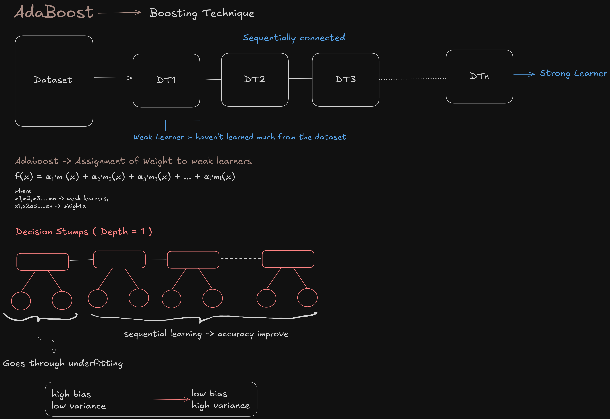

# AdaBoost (Adaptive Boosting)

## Overview

AdaBoost (Adaptive Boosting) is a powerful ensemble learning technique that combines multiple weak learners to form a strong classifier or regressor.

---

## Theory

- **Ensemble Method**: AdaBoost builds a strong model by sequentially training weak learners (typically shallow decision trees), where each new learner focuses more on the mistakes of the previous ones.
- **Weighting**: Initially, all samples are weighted equally. After each iteration, the weights of misclassified samples are increased so that subsequent learners focus more on difficult cases.
- **Final Prediction**: For classification, AdaBoost combines the predictions of all weak learners using a weighted majority vote. For regression, it uses a weighted sum.

### AdaBoost Algorithm (Classifier)

1. Initialize sample weights equally.
2. For each round:
   - Train a weak learner (e.g., decision stump) on the weighted data.
   - Compute the weighted error rate.
   - Increase weights for misclassified samples.
   - Decrease weights for correctly classified samples.
3. Final prediction is a weighted vote of all weak learners.

### AdaBoost Algorithm (Regressor)

- Similar to classification, but the final prediction is a weighted sum of the weak learners' outputs.

---

## AdaBoost in This Project

### 1. AdaBoost Classifier: Holiday Package Prediction
- **Problem**: Predict whether a customer will purchase a holiday package based on demographic and behavioral data.
- **Data**: 4888 samples, 20 features (after cleaning and feature engineering).
- **Preprocessing**:
  - Handling missing values and categorical encoding
  - Feature engineering (e.g., total visitors)
  - One-hot encoding and scaling
- **Model Comparison**: AdaBoost was compared with Logistic Regression, Decision Tree, Random Forest, and Gradient Boosting.
- **Metrics Used**:
  - Accuracy
  - F1 Score
  - Precision
  - Recall
  - ROC-AUC
- **Results** (Test Set):
  - **Accuracy**: 0.835
  - **F1 Score**: 0.799
  - **Precision**: 0.750
  - **Recall**: 0.236
  - **ROC-AUC**: 0.608
- **Hyperparameter Tuning**: Grid/random search for `n_estimators` and `algorithm` (SAMME, SAMME.R)

### 2. AdaBoost Regressor: Used Car Price Prediction
- **Problem**: Predict the selling price of used cars based on features like model, year, fuel type, etc.
- **Data**: 15,411 samples, 13 features (after cleaning and encoding).
- **Preprocessing**:
  - Handling missing values
  - Label encoding and one-hot encoding
  - Feature scaling
- **Model Comparison**: AdaBoost Regressor was compared with Linear Regression, Lasso, Ridge, KNN, Decision Tree, and Random Forest.
- **Metrics Used**:
  - Root Mean Squared Error (RMSE)
  - Mean Absolute Error (MAE)
  - R² Score
- **Results** (Test Set):
  - **RMSE**: 522,317
  - **MAE**: 355,591
  - **R² Score**: 0.638
- **Hyperparameter Tuning**: Grid/random search for `n_estimators` and `loss` (linear, square, exponential)

---
