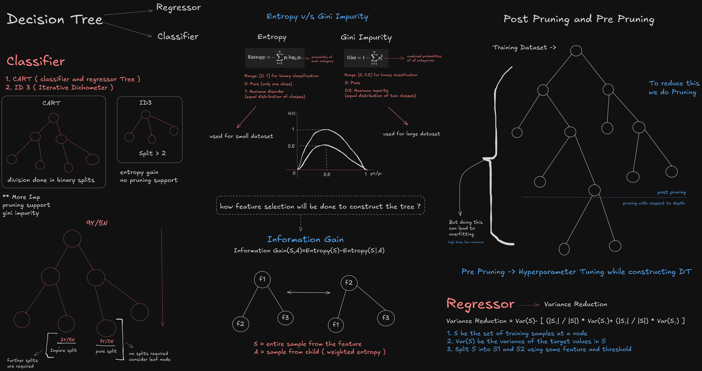

# Decision Trees

## Introduction

They work by creating a model that predicts the value/class of a target variable by learning simple decision rules inferred from the data features.



## Fundamental Concepts

### Tree Structure

A decision tree consists of:

- **Root Node**: The topmost node where the first split occurs
- **Internal Nodes**: Where decisions/splits are made based on features
- **Leaf Nodes**: Terminal nodes that contain the final predictions
- **Branches**: Connections between nodes representing decision outcomes

### Types of Decision Trees

1. **Classification Trees**: Predict discrete class labels
2. **Regression Trees**: Predict continuous values

## Mathematical Foundation

### Split Criteria

#### For Classification

##### Entropy

Measures the impurity/uncertainty in the dataset:
$$Entropy = -\sum_{i=1}^{c} p_i \log_2 p_i$$
Where:

- $p_i$ is the probability of class i
- Range: [0, 1] for binary classification

##### Gini Impurity

Alternative to entropy, measures the probability of incorrect classification:
$$Gini = 1 - \sum_{i=1}^{c} p_i^2$$
Where:

- Range: [0, 0.5] for binary classification
- Used in CART (Classification and Regression Trees)

#### For Regression

##### Variance Reduction

Measures the homogeneity of the target variable:
$$Variance\ Reduction = Var(S) - [\frac{|S_1|}{|S|} * Var(S_1) + \frac{|S_2|}{|S|} * Var(S_2)]$$
Where:

- S is the set of training samples at a node
- S₁ and S₂ are the subsets after the split

### Information Gain

Measures the effectiveness of a split:
$$Information\ Gain(S,A) = Entropy(S) - Entropy(S|A)$$
Where:

- S is the set of training samples
- A is the feature being evaluated for splitting

## Algorithm Steps

### Training Phase

1. Start at the root node with all training samples
2. For each feature:
   - Calculate the potential split points
   - Evaluate split criteria (entropy/gini/variance)
   - Select the best split
3. Create child nodes based on the split
4. Recursively repeat for each child node
5. Stop when stopping criteria are met

### Prediction Phase

1. Start at the root node
2. Follow the decision path based on feature values
3. Return the prediction at the leaf node

## Implementation Considerations

### Hyperparameters

#### Pre-Pruning Parameters

- `max_depth`: Maximum depth of the tree
- `min_samples_split`: Minimum samples required to split a node
- `min_samples_leaf`: Minimum samples required at a leaf node
- `max_features`: Maximum number of features to consider for splitting

#### Post-Pruning Parameters

- `ccp_alpha`: Complexity parameter for cost-complexity pruning
- Validation set pruning thresholds

### Feature Handling

- Can handle both numerical and categorical features
- No need for feature scaling
- Handles missing values naturally
- Feature importance calculation built-in

## Advantages and Limitations

### Advantages

1. Easy to understand and interpret
2. Requires little data preprocessing
3. Can handle both numerical and categorical data
4. Handles non-linear relationships well
5. Provides feature importance rankings
6. Non-parametric (no assumptions about data distribution)

### Limitations

1. Can create overly complex trees (overfitting)
2. Unstable - small changes in data can result in very different trees
3. May create biased trees if classes are imbalanced
4. Not optimal for continuous variable prediction
5. Greedy algorithm - may not find the globally optimal tree

## Advanced Concepts

### Pruning Techniques

#### Pre-Pruning (Early Stopping)

- Stop growing the tree based on predefined criteria
- Prevents overfitting during tree construction
- Uses parameters like max_depth, min_samples_split

#### Post-Pruning

- Build full tree then remove branches
- Uses cost-complexity pruning
- Reduces tree size while maintaining performance

### Feature Selection

Decision trees perform built-in feature selection:
$$Feature\ Importance = \sum_{nodes\ using\ feature} weighted\ impurity\ decrease$$

### Handling Imbalanced Data

1. Class weights
2. Balanced subsample techniques
3. Adjusted split criteria

## Implementation Example

```python
from sklearn.tree import DecisionTreeClassifier, DecisionTreeRegressor

# Classification Tree
clf = DecisionTreeClassifier(
    criterion='gini',  # or 'entropy'
    max_depth=5,
    min_samples_split=2,
    min_samples_leaf=1
)

# Regression Tree
reg = DecisionTreeRegressor(
    criterion='squared_error',  # or 'absolute_error'
    max_depth=5,
    min_samples_split=2,
    min_samples_leaf=1
)

# Training
model.fit(X_train, y_train)

# Prediction
y_pred = model.predict(X_test)
```
