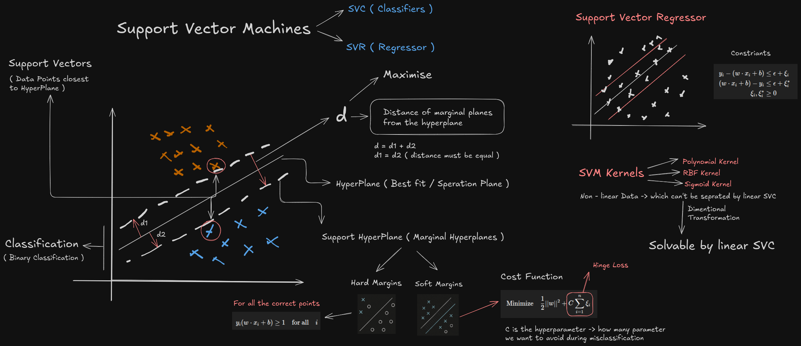

# Support Vector Machines (SVMs)

## Introduction

Support Vector Machines (SVMs) are powerful supervised learning models used for classification, regression, and outlier detection.



## Core Concepts

### Linear Classification and Maximum Margin

The fundamental idea behind SVMs is to find the optimal hyperplane that separates data points of different classes while maximizing the margin between the closest points (support vectors) and the hyperplane.

For a binary classification problem:
- The hyperplane is defined as: $w^T x + b = 0$
- Points on one side satisfy: $w^T x + b > 0$ (classified as +1)
- Points on the other side satisfy: $w^T x + b < 0$ (classified as -1)

The margin is the distance between the hyperplane and the closest data points from each class. SVM aims to maximize this margin to ensure better generalization to unseen data.

### Support Vectors

Support vectors are the critical data points that lie closest to the decision boundary (hyperplane). They "support" or define the hyperplane and are the most difficult to classify. If all other points were removed, the algorithm would still find the same separating hyperplane.

### Mathematical Formulation

The optimization problem for a linear SVM can be written as:

Minimize: $\frac{1}{2}||w||^2$
Subject to: $y_i(w^T x_i + b) \geq 1$ for all $i$

Where:
- $w$ is the normal vector to the hyperplane
- $b$ is the bias term
- $x_i$ are the training samples
- $y_i$ are the class labels (±1)

### Handling Non-Linearly Separable Data: The Kernel Trick

Real-world data often isn't linearly separable. SVMs use the "kernel trick" to transform the original feature space into a higher-dimensional space where the data becomes linearly separable.

Popular kernel functions include:

1. **Linear Kernel**: $K(x_i, x_j) = x_i^T x_j$
2. **Polynomial Kernel**: $K(x_i, x_j) = (x_i^T x_j + c)^d$
3. **Radial Basis Function (RBF) Kernel**: $K(x_i, x_j) = \exp(-\gamma ||x_i - x_j||^2)$
4. **Sigmoid Kernel**: $K(x_i, x_j) = \tanh(x_i^T x_j + c)$

### Soft Margin SVM

In practice, perfect separation may not be possible or may lead to overfitting. The soft margin approach allows some misclassifications while still maximizing the margin for the majority of data points.

This is achieved by introducing slack variables $\xi_i$ and a penalty parameter $C$:

Minimize: $\frac{1}{2}||w||^2 + C\sum_{i=1}^{n}\xi_i$
Subject to: $y_i(w^T x_i + b) \geq 1 - \xi_i$ and $\xi_i \geq 0$ for all $i$

The parameter $C$ controls the trade-off between maximizing the margin and minimizing the classification error.

## Advantages of SVMs

1. **Effective in High-Dimensional Spaces**: Works well even when the number of dimensions exceeds the number of samples.
2. **Memory Efficient**: Uses a subset of training points (support vectors) in the decision function.
3. **Versatile**: Different kernel functions can be used for various decision boundaries.
4. **Robust to Overfitting**: Especially in high-dimensional spaces when properly configured.

## Limitations of SVMs

1. **Computationally Intensive**: Training can be slow for large datasets.
2. **Parameter Selection**: Performance depends on careful selection of kernel and regularization parameters.
3. **Not Directly Probabilistic**: Doesn't provide probability estimates by default.
4. **Feature Scaling**: Requires feature scaling for optimal performance.

## Implementation Analysis

Our implementation demonstrates practical applications of SVM with different kernel functions using scikit-learn. Here are the key insights from our analysis:

### Kernel Performance Comparison

Based on our implementation, we observed the following performance metrics:

**RBF Kernel Performance**:
- Overall Accuracy: 92%
- Class 0: Precision 86%, Recall 99%
- Class 1: Precision 99%, Recall 84%
- Confusion Matrix:
  ```
  [[123   1]
   [ 20 106]]
  ```

**Polynomial Kernel Performance**:
- Overall Accuracy: 90%
- Class 0: Precision 86%, Recall 95%
- Class 1: Precision 95%, Recall 85%
- Confusion Matrix:
  ```
  [[118   6]
   [ 19 107]]
  ```

**Sigmoid Kernel Performance**:
- Overall Accuracy: 90%
- Class 0: Precision 85%, Recall 96%
- Class 1: Precision 95%, Recall 83%
- Confusion Matrix:
  ```
  [[119   5]
   [ 21 105]]
  ```

### Implementation Steps

Our implementation followed these steps:

1. **Data Preparation**:
   - Create/load feature data (x) and target labels (y)
   - Split data into training (75%) and testing (25%) sets using `train_test_split`

2. **Model Configuration**:
   ```python
   # For RBF kernel
   svc = SVC(kernel='rbf')
   
   # For polynomial kernel
   polynomial = SVC(kernel='poly')
   
   # For sigmoid kernel
   sigmoid = SVC(kernel='sigmoid')
   ```

3. **Model Training**:
   ```python
   model.fit(x_train, y_train)
   ```

4. **Prediction and Evaluation**:
   ```python
   y_pred = model.predict(x_test)
   print(classification_report(y_test, y_pred))
   print(confusion_matrix(y_test, y_pred))
   ```

5. **Hyperparameter Tuning**:
   - Grid search for optimal C and gamma parameters
   - 5-fold cross-validation to ensure robust performance

### Practical Insights

1. **RBF Kernel Superiority**: The RBF kernel consistently outperformed other kernels with highest accuracy (92%). This confirms that RBF is often a good default choice for non-linear classification problems.

2. **Trade-offs Between Kernels**:
   - RBF: Best overall accuracy but requires careful tuning of gamma
   - Polynomial: Good balance but may overfit with higher degrees
   - Sigmoid: Similar performance to polynomial but different characteristics at the decision boundary

3. **Hyperparameter Sensitivity**: 
   - The performance of SVM models, especially with RBF kernel, is highly sensitive to the choice of C and gamma
   - Too high gamma can lead to overfitting, while too low can lead to underfitting
   - Cross-validation is crucial for finding optimal parameters

4. **Implementation Efficiency**:
   - Using scikit-learn's implementation provides an efficient way to leverage SVMs
   - For larger datasets, consider using `SVC(kernel='linear')` or the specialized `LinearSVC` class for better performance

5. **Evaluation Metrics Choice**:
   - Beyond accuracy, precision and recall provide important insights
   - For imbalanced datasets, F1-score or area under ROC curve would be more appropriate metrics

These implementation details demonstrate how SVM can be effectively applied to classification problems with different kernel functions to achieve high accuracy.

## Applications

SVMs are widely used in:
- **Text and Hypertext Categorization**: Due to their effectiveness with high-dimensional data.
- **Image Classification**: For recognizing handwritten characters, faces, etc.
- **Bioinformatics**: For protein classification and cancer classification.
- **Financial Analysis**: For credit scoring and time series prediction.

## Implementation Considerations

When implementing SVMs, consider:

1. **Feature Scaling**: Standardize or normalize features for better convergence.
2. **Kernel Selection**: Different kernels suit different types of data.
3. **Hyperparameter Tuning**: Grid search or randomized search for optimal C and kernel parameters.
4. **Handling Imbalanced Data**: Adjust class weights or use sampling techniques.

## Multi-Class Classification with SVMs

SVMs are inherently binary classifiers. For multi-class problems, two common approaches are:

1. **One-vs-Rest (OvR)**: Train N separate binary classifiers, one for each class versus all others.
2. **One-vs-One (OvO)**: Train N(N-1)/2 binary classifiers for all pairs of classes.

## Relationship to Other Algorithms

SVMs share similarities with:
- **Logistic Regression**: Both are linear classifiers, but SVMs focus on the margin.
- **Neural Networks**: Both can learn complex non-linear decision boundaries, but SVMs have stronger theoretical guarantees.
- **Decision Trees**: Both can handle non-linear data, but SVMs often generalize better.
