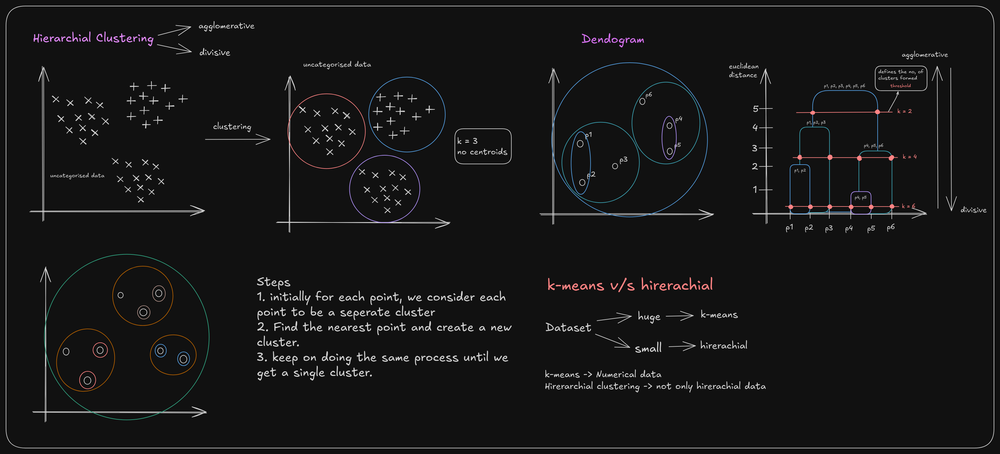

# Hierarchical Clustering

## Introduction

Hierarchical Clustering is an unsupervised learning algorithm that builds a hierarchy of clusters by either merging smaller clusters into larger ones (agglomerative) or dividing larger clusters into smaller ones (divisive). Unlike K-Means, it doesn't require specifying the number of clusters beforehand and creates a tree-like structure called a dendrogram.



---

## Fundamental Concepts

### Basic Idea

Hierarchical Clustering creates a tree of clusters where each node represents a cluster and the height represents the distance at which clusters merge. The algorithm can work in two directions:

- **Agglomerative (Bottom-up)**: Start with individual points as clusters and merge them
- **Divisive (Top-down)**: Start with all points in one cluster and divide them

### Key Components

- **Dendrogram**: A tree diagram showing the hierarchy of clusters
- **Distance Metrics**: Methods to measure similarity between clusters
- **Linkage Criteria**: Rules for determining when to merge clusters
- **Threshold**: Distance value that determines the number of clusters

---

## Mathematical Foundation

### Distance Metrics

#### Point-to-Point Distances

**Euclidean Distance**:
$$d(p, q) = \sqrt{\sum_{i=1}^{n} (p_i - q_i)^2}$$

**Manhattan Distance**:
$$d(p, q) = \sum_{i=1}^{n} |p_i - q_i|$$

**Cosine Distance**:
$$d(p, q) = 1 - \frac{\sum_{i=1}^{n} p_i q_i}{\sqrt{\sum_{i=1}^{n} p_i^2} \sqrt{\sum_{i=1}^{n} q_i^2}}$$

#### Cluster-to-Cluster Distances

**Single Linkage (Minimum Distance)**:
$$d(C_1, C_2) = \min_{x \in C_1, y \in C_2} d(x, y)$$

**Complete Linkage (Maximum Distance)**:
$$d(C_1, C_2) = \max_{x \in C_1, y \in C_2} d(x, y)$$

**Average Linkage (Mean Distance)**:
$$d(C_1, C_2) = \frac{1}{|C_1| \cdot |C_2|} \sum_{x \in C_1} \sum_{y \in C_2} d(x, y)$$

**Ward's Method**:
$$d(C_1, C_2) = \frac{|C_1| \cdot |C_2|}{|C_1| + |C_2|} \|\mu_{C_1} - \mu_{C_2}\|^2$$

Where $\mu_{C_i}$ is the centroid of cluster $C_i$.

---

## Algorithm Steps

### Agglomerative Hierarchical Clustering

1. **Initialization**:

   - Start with n clusters, each containing one data point
   - Compute distance matrix between all pairs of points

2. **Iterative Merging**:
   - Find the two closest clusters
   - Merge them into a new cluster
   - Update the distance matrix
   - Repeat until only one cluster remains

3. **Dendrogram Construction**:
   - Record the merging order and distances
   - Build tree structure showing cluster hierarchy

### Detailed Steps

1. **Initially, for each point, we consider each point to be a separate cluster**
2. **Find the nearest point and create a new cluster**
3. **Keep on doing the same process until we get a single cluster**

### Algorithm Pseudocode

```markdown
Initialize: n clusters, each with one point
Compute: distance matrix D
For i = 1 to n-1:
    Find: clusters C1, C2 with minimum distance
    Merge: C1 and C2 into new cluster C_new
    Update: distance matrix D
    Record: merge in dendrogram
End For
```

---

## Dendrogram Interpretation

### Structure

The dendrogram is a tree-like visualization where:

- **Y-axis**: Represents Euclidean distance (or other distance metric)
- **X-axis**: Shows individual data points
- **Horizontal lines**: Indicate cluster merges at specific distances
- **Vertical lines**: Connect points to their merge points

### Reading the Dendrogram

1. **Bottom Level**: Each point is its own cluster (k = n)
2. **Intermediate Levels**: Points merge into clusters at increasing distances
3. **Top Level**: All points belong to one cluster (k = 1)

### Determining Number of Clusters

- **Threshold Method**: Draw a horizontal line at desired distance
- **K-value Selection**: Count clusters at specific distance levels
- **Elbow Method**: Look for significant changes in merge distances

---

## Implementation Considerations

### Hyperparameters

- **n_clusters**: Number of clusters to extract (optional)
- **linkage**: Linkage criterion ('ward', 'complete', 'average', 'single')
- **affinity**: Distance metric ('euclidean', 'manhattan', 'cosine', 'precomputed')
- **compute_full_tree**: Whether to compute full tree or stop at n_clusters

### Data Preprocessing

1. **Feature Scaling**: Essential for distance-based algorithms
   - StandardScaler: $(x - \mu) / \sigma$
   - MinMaxScaler: $(x - x_{min}) / (x_{max} - x_{min})$

2. **Handling Categorical Variables**:
   - One-hot encoding for nominal variables
   - Label encoding for ordinal variables

3. **Missing Values**: Remove or impute before clustering

### Computational Complexity

- **Time Complexity**: O(n²) for most linkage methods
- **Space Complexity**: O(n²) for distance matrix storage
- **Scalability**: Limited to datasets with n < 10,000 points

---

## Advantages and Limitations

### Advantages

1. **No Need to Specify k**: Automatically determines cluster hierarchy
2. **Flexible**: Can handle non-spherical cluster shapes
3. **Interpretable**: Dendrogram provides clear cluster relationships
4. **Deterministic**: Same result every time for same data
5. **Handles Mixed Data**: Can work with various data types
6. **No Centroids**: Doesn't assume cluster centers exist

### Limitations

1. **Computational Cost**: O(n²) complexity limits scalability
2. **Sensitive to Noise**: Outliers can affect entire hierarchy
3. **Greedy Algorithm**: Local decisions may not be globally optimal
4. **Irreversible**: Once clusters merge, they cannot be split
5. **Distance Metric Dependency**: Results heavily depend on chosen metric
6. **Memory Intensive**: Requires storing full distance matrix

---

## Comparison with K-Means

### Dataset Size Considerations

- **Huge Datasets**: K-Means is preferred due to O(nkd) complexity
- **Small Datasets**: Hierarchical Clustering works well and provides more insights

### Data Type Handling

- **K-Means**: Primarily designed for numerical data
- **Hierarchical Clustering**: Can handle broader range of data types including:
  - Categorical data (with appropriate distance metrics)
  - Mixed data types
  - Non-numerical similarity measures

### Key Differences

| Aspect | K-Means | Hierarchical Clustering |
|--------|---------|-------------------------|
| **Centroids** | Yes, explicit centroids | No centroids |
| **Cluster Count** | Must specify k | Automatically determined |
| **Shape Assumption** | Spherical clusters | Flexible shapes |
| **Scalability** | O(nkd) per iteration | O(n²) |
| **Interpretability** | Cluster centers | Full hierarchy |
| **Flexibility** | Fixed k | Dynamic k selection |

---

## Implementation Example

```python
from sklearn.cluster import AgglomerativeClustering
from sklearn.preprocessing import StandardScaler
from scipy.cluster.hierarchy import dendrogram, linkage
import matplotlib.pyplot as plt
import numpy as np

# Data preprocessing
scaler = StandardScaler()
X_scaled = scaler.fit_transform(X)

# Method 1: Using AgglomerativeClustering
agg_clustering = AgglomerativeClustering(
    n_clusters=3,  # Optional: specify number of clusters
    linkage='ward',
    affinity='euclidean'
)

cluster_labels = agg_clustering.fit_predict(X_scaled)

# Method 2: Using scipy for full dendrogram
linkage_matrix = linkage(X_scaled, method='ward')

# Plot dendrogram
plt.figure(figsize=(10, 7))
dendrogram(linkage_matrix, labels=range(len(X_scaled)))
plt.title('Hierarchical Clustering Dendrogram')
plt.xlabel('Sample Index')
plt.ylabel('Distance')
plt.show()

# Determine number of clusters from dendrogram
# Look for significant gaps in merge distances
```

---
