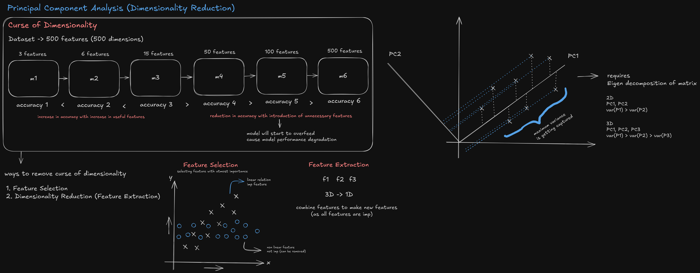

# Principal Component Analysis (PCA)

## Introduction

Principal Component Analysis (PCA) is an unsupervised dimensionality reduction technique that transforms a high-dimensional dataset into a lower-dimensional space while preserving as much variance as possible. It helps mitigate the curse of dimensionality, improves model performance, speeds up training, and aids visualization.



## Core Concepts

- **Variance Maximization**: PCA finds new orthogonal axes (principal components) that capture maximal variance in descending order.
- **Orthogonality**: Each principal component (PC) is orthogonal to the others, removing linear redundancy.
- **Linear Projections**: Original features are linearly projected onto the PC axes to form new features.
- **Explained Variance Ratio (EVR)**: Quantifies the fraction of total variance captured by each component; used to choose the number of components.

## Mathematical Foundation

- **Standardize features** (mean 0, variance 1). Let standardized data matrix be $X \in \mathbb{R}^{n \times p}$.
- **Covariance matrix**: $S = \frac{1}{n-1} X^\top X$.
- **Eigen decomposition**: $S v_i = \lambda_i v_i$, where $\lambda_1 \geq \lambda_2 \geq \cdots \geq \lambda_p$ and $v_i$ are eigenvectors.
- **Principal components**: Loadings matrix $W_k = [v_1,\ldots,v_k]$. The reduced representation is $Z = X W_k$.
- **Explained variance**: $EVR_i = \lambda_i / \sum_{j=1}^{p} \lambda_j$. Cumulative EVR helps select $k$ such that $\sum_{i=1}^{k} EVR_i \geq \tau$ (e.g., $\tau = 0.95$).

## Algorithm Steps

1. Standardize features.
2. Compute covariance matrix or use SVD on the standardized data.
3. Perform eigen/SVD decomposition and sort by descending eigenvalues/singular values.
4. Choose $k$ by EVR or cross-validation.
5. Project data onto the top-$k$ components to obtain reduced features.

## Implementation (scikit-learn)

```python
from sklearn.decomposition import PCA
from sklearn.preprocessing import StandardScaler
from sklearn.pipeline import Pipeline

pca_pipeline = Pipeline([
    ("scaler", StandardScaler()),
    ("pca", PCA(n_components=0.95, svd_solver="full"))  # keep 95% variance
])

Z = pca_pipeline.fit_transform(X)  # X: numpy array or pandas DataFrame

# Explained variance information
pca = pca_pipeline.named_steps["pca"]
explained_variance_ratio = pca.explained_variance_ratio_
cumulative_evr = explained_variance_ratio.cumsum()
```

### Choosing the Number of Components

- **Fixed k**: `PCA(n_components=k)`
- **By variance**: `PCA(n_components=0.95)` retains 95% variance
- **With cross-validation**: Evaluate downstream model performance versus k

### Whitening (optional)

- `PCA(whiten=True)` scales PC scores by the inverse of their standard deviations. Useful for some models, but may amplify noise.

## Advantages

- Reduces dimensionality and multicollinearity
- Speeds up training and inference
- Enables 2D/3D visualization of high-dimensional data
- Acts as a noise filter when low-variance directions are removed

## Limitations

- Linear method; cannot capture non-linear structure (consider Kernel PCA, t-SNE, UMAP)
- Principal components are linear combinations of features and can be harder to interpret
- Sensitive to feature scaling and outliers

## Practical Tips

- Always standardize features before PCA (especially when units/scales differ)
- Inspect scree plot and cumulative EVR to select $k$
- For downstream supervised learning, validate that PCA actually improves accuracy/generalization
- Use `inverse_transform` to approximate original features and assess reconstruction error if needed

## Related Methods

- **SVD**: Numerical backbone of PCA; `TruncatedSVD` can be used for sparse data
- **Kernel PCA**: Non-linear variant using kernels
- **LDA (Linear Discriminant Analysis)**: Supervised dimensionality reduction maximizing class separability
- **t-SNE/UMAP**: Non-linear visualization techniques, not linear embeddings like PCA

## Minimal End-to-End Example

```python
from sklearn.datasets import load_wine
from sklearn.linear_model import LogisticRegression
from sklearn.model_selection import train_test_split
from sklearn.pipeline import Pipeline
from sklearn.preprocessing import StandardScaler
from sklearn.decomposition import PCA

X, y = load_wine(return_X_y=True)

clf = Pipeline([
    ("scaler", StandardScaler()),
    ("pca", PCA(n_components=0.95)),
    ("logreg", LogisticRegression(max_iter=500))
])

X_train, X_test, y_train, y_test = train_test_split(X, y, test_size=0.25, random_state=0)
clf.fit(X_train, y_train)
score = clf.score(X_test, y_test)
print(f"Test accuracy with PCA: {score:.3f}")
```

## Applications

- Visualization of high-dimensional data (2D/3D plots)
- Preprocessing for clustering/classification/regression
- Noise reduction and compression
- Feature engineering by summarizing correlated variables
